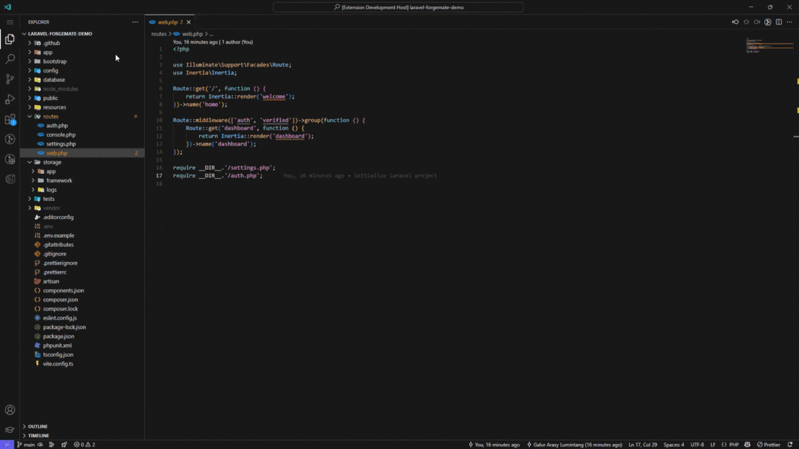
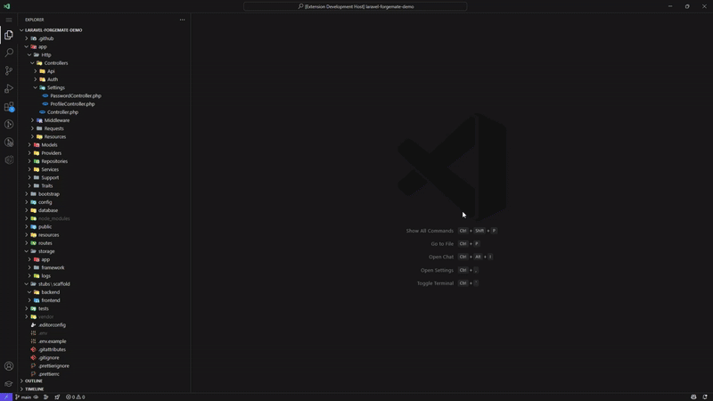

# Laravel Forgemate

A powerful VS Code extension for automatically generating Laravel scaffolding with service-repository pattern support for both backend and frontend layers.



## Key Features

- Dynamic scaffolding based on your model structure
- Comprehensive code generation for service-repository pattern
- Full TypeScript support for frontend components
- Integration with your existing project structure
- Intelligent relationship handling
- UI for visually creating your models

## Default Package Integrations

Laravel Forgemate is designed to work seamlessly with specific packages by default, but you can customize the generated code to work with any stack.

### Backend Defaults

- **[Laravel Repository Service Pattern](https://github.com/adobrovolsky97/laravel-repository-service-pattern)**: Used to handle service and repository processes, effectively decoupling the application's business logic from the specific implementation details of data storage. All generated backend code follows this pattern.

### Frontend Defaults

- **[@tanstack/react-query](https://tanstack.com/query/latest)**: The generated service hooks are built with TanStack Query (formerly React Query) to handle data transaction processes efficiently. You can see this in the implementation of the serviceHooksFactory.ts files.
- **NyxbUI**: The scaffolding is designed to work with this ReactJS component library, which is similar to ShadCN but with enhanced animations and unique components. Frontend templates assume the use of these UI components.

> **Note**: If your project uses different packages, you can customize the stubs to match your tech stack. See the "Customizing Stubs" section below for details.

## Laravel Compatibility

### Laravel 11+ Support

Laravel Forgemate fully supports Laravel 11+ with the following enhancements:

| Feature                 | Description                                                          |
| ----------------------- | -------------------------------------------------------------------- |
| New Directory Structure | Automatically adapts to Laravel 11's streamlined directory structure |
| PHP 8.2+ Compatibility  | All generated code uses PHP 8.2+ syntax and features                 |
| Invokable Controllers   | Option to generate single-action invokable controllers               |
| Pest Testing            | Support for generating Pest test files instead of PHPUnit            |
| Route Attributes        | Support for PHP attributes-based routing in controllers              |

### Minimum Requirements

- Laravel 9.0+
- PHP 8.1+ (PHP 8.2+ recommended for Laravel 11)
- Node.js 16+ for frontend assets
- VS Code 1.85.0+

## Installation

1. Install the extension from VS Code Marketplace
2. Open your Laravel project in VS Code
3. (optional) Initialize your project structure with `Laravel Forgemate: Initialize Project`

## Quick Start

### 1. Initialize Project Structure

Run `Laravel Forgemate: Initialize Project` to set up base files for service-repository pattern.

### 2. Generate Your First Scaffold

Either:

- Use `Laravel Forgemate: Open UI Panel` to use the visual interface
- Or run `Laravel Forgemate: Generate Scaffold` to use the command palette

### 3. Define Model Attributes

For example, for an ArticleNews model:

| Attribute      | Type     | Description      |
| -------------- | -------- | ---------------- |
| title          | string   | Article title    |
| description    | text     | Article content  |
| published_date | datetime | Publication date |
| is_archived    | boolean  | Archive status   |

### 4. Generate Code

Click "Generate Scaffold" and the extension will create:

#### Backend Files

- Models/ArticleNews.php
- Repositories/ArticleNewsRepository.php
- Support/Interfaces/Repositories/ArticleNewsRepositoryInterface.php
- Services/ArticleNewsService.php
- Support/Interfaces/Services/ArticleNewsServiceInterface.php
- Http/Controllers/ArticleNewsController.php
- Http/Controllers/Api/ArticleNewsController.php (if API enabled)
- Http/Requests/ArticleNews/StoreArticleNewsRequest.php
- Http/Requests/ArticleNews/UpdateArticleNewsRequest.php
- Http/Resources/ArticleNewsResource.php
- Databases/Migrations/yyyy_mm_dd_create_article_news_table.php
- Databases/Factories/ArticleNewsFactory.php
- Databases/Seeders/ArticleNewsSeeder.php

#### Frontend Files

- Support/Interfaces/Models/ArticleNews.ts
- Support/Interfaces/Resources/ArticleNewsResource.ts
- Services/articleNewsServiceHook.ts
- Updates to routes.ts and index exports

## Template Variables

Using this sample model for examples:

**Model: WarehouseItem**  
**Attributes:**

- title (string)
- description (text)
- qty (integer)

### General Naming Variables

| Variable                | Description           | Example Value  |
| ----------------------- | --------------------- | -------------- |
| {{modelName}}           | Raw model name        | WarehouseItem  |
| {{modelLowercase}}      | Lowercase name        | warehouseitem  |
| {{modelUppercase}}      | Uppercase name        | WAREHOUSEITEM  |
| {{modelCamelCase}}      | camelCase name        | warehouseItem  |
| {{modelPascalCase}}     | PascalCase name       | WarehouseItem  |
| {{modelSnakeCase}}      | snake_case name       | warehouse_item |
| {{modelKebabCase}}      | kebab-case name       | warehouse-item |
| {{modelUpperSnakeCase}} | UPPER_SNAKE_CASE name | WAREHOUSE_ITEM |

### Pluralization Variables

| Variable                 | Description                             | Example Value   |
| ------------------------ | --------------------------------------- | --------------- |
| {{modelPlural}}          | Pluralized name                         | WarehouseItems  |
| {{modelPluralLowercase}} | Lowercase plural                        | warehouseitems  |
| {{tableName}}            | Database table name (plural snake_case) | warehouse_items |

### Attribute Variables

| Variable                                 | Description                               | Example Value                                                                                                               |
| ---------------------------------------- | ----------------------------------------- | --------------------------------------------------------------------------------------------------------------------------- |
| {{modelStringAttributesWithComma}}       | Comma-separated list of attributes        | title, description, qty                                                                                                     |
| {{modelStringAttributesWithCommaQuoted}} | Quoted comma-separated list of attributes | 'title', 'description', 'qty'                                                                                               |
| {{tsInterfaceProperties}}                | TypeScript interface properties           | title: string;<br>description: string;<br>qty: number;                                                                      |
| {{requestRules}}                         | Laravel validation rules                  | 'title' => 'required\|string\|max:255',<br>'description' => 'nullable\|string',<br>'qty' => 'required\|integer',            |
| {{factoryDefinitions}}                   | Factory definitions                       | 'title' => $this->faker->word(),<br>'description' => $this->faker->text(),<br>'qty' => $this->faker->numberBetween(1, 100), |
| {{migrationColumns}}                     | Full migration column definitions         | $table->string('title');<br>$table->text('description')->nullable();<br>$table->integer('qty');                             |
| {{resourceAttributes}}                   | Resource attributes                       | 'title' => $this->title,<br>'description' => $this->description,<br>'qty' => $this->qty,                                    |
| {{modelCasts}}                           | Model attribute casting                   | 'qty' => 'integer',                                                                                                         |

### Relationship Variables

| Variable                  | Description                | Example Value                                                                      |
| ------------------------- | -------------------------- | ---------------------------------------------------------------------------------- |
| {{modelRelationships}}    | Model relationship methods | public function category()<br>{<br> return $this->belongsTo(Category::class);<br>} |
| {{resourceRelationships}} | Resource relationships     | 'category' => CategoryResource::make($this->whenLoaded('category')),               |

## Customizing Stubs

One of Laravel Forgemate's most powerful features is the ability to customize the templates (stubs) used for code generation. This allows you to tailor the generated code to match your project's coding style and requirements.

### Using the Synchronize Stubs Command

The easiest way to customize stubs is to use the built-in "Synchronize Stubs" command:

1. Open the command palette with `Ctrl+Shift+P`
2. Type "Laravel Forgemate: Synchronize Stubs" and press Enter
3. This will copy all the default stubs to your Laravel project's stubs directory
4. You can then customize any of these stubs to match your project's needs

Alternatively, you can use the "Laravel Forgemate: Synchronize Stubs" command from the UI panel.


### Benefits of Customizing Stubs

- **Consistent coding style**: Ensure all generated code follows your team's conventions
- **Project-specific requirements**: Add custom methods or properties that your project needs
- **Enhanced TypeScript support**: Improve type safety in your frontend code
- **Time-saving**: Define the structure once, reuse it across your entire project

### Available Stub Types

- Backend stubs (PHP): models, controllers, repositories, services, etc.
- Frontend stubs (TypeScript): interfaces, service hooks, etc.

Customizing stubs gives you complete control over the generated code while still benefiting from the automation that Laravel Forgemate provides!

## Development & Release Process

### Automated Release Process

This extension uses an automated release process to simplify versioning and publishing to the VS Code Marketplace.

#### Making a New Release

1. Make sure your changes are committed to the main branch
2. Run one of the following commands:
   ```bash
   # For patch version bump (0.1.2 -> 0.1.3)
   npm run release:patch
   
   # For minor version bump (0.1.2 -> 0.2.0)
   npm run release:minor
   
   # For major version bump (0.1.2 -> 1.0.0)
   npm run release:major
   
   # For a specific version
   npm run release:custom 1.2.3
   ```

3. The script will:
   - Update version in package.json and package-lock.json
   - Update CHANGELOG.md with a new version entry
   - Create a git commit with these changes
   - Create a git tag for the new version

4. Update the changelog with your specific changes
5. Push the changes and tag:
   ```bash
   git push origin main
   git push origin v0.1.3  # Use your specific version tag
   ```

6. The GitHub Action will automatically:
   - Verify the tag version matches the package.json
   - Build and package the extension
   - Publish to the VS Code Marketplace
   - Create a GitHub Release with the changelog contents

> Note: You need to set up a `VSCE_PAT` secret in your GitHub repository settings with a valid Visual Studio Marketplace Personal Access Token.

## Support

If you encounter any issues or have feature requests, please file an issue on our [GitHub repository](https://github.com/evanightly/laravel-forgemate).

## License

This extension is licensed under the MIT License.
